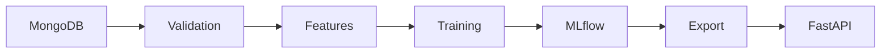

# ChurnStream

ChurnStream is an end-to-end customer churn prediction service. It validates
customer data from MongoDB, benchmarks scikit-learn classifiers, tracks and
registers models with MLflow, and serves the exported champion model through a
FastAPI API.

## Architecture



The saved artifact is a single scikit-learn pipeline containing feature
engineering, preprocessing, and the classifier. Training and inference
therefore use the same transformations.

## Features

- Pydantic validation for training records and prediction requests
- Numeric and categorical preprocessing in one reusable pipeline
- Engineered customer balance, tenure, and engagement features
- Stratified cross-validation across baseline and ensemble classifiers
- MLflow experiment tracking, Model Registry, and a `champion` alias
- FastAPI prediction, health, and model metadata endpoints
- Docker image running as a non-root user
- Ruff, pytest, coverage, and Docker build checks in GitHub Actions

## Requirements

- Python 3.11 or newer
- [uv](https://docs.astral.sh/uv/)
- A MongoDB collection containing the training data
- An MLflow tracking server for training and model export
- Docker, when running the containerized API

## Local setup

```bash
git clone https://github.com/wuttipansat/churnstream.git
cd churnstream
cp .env.example .env
uv sync --extra dev --extra training
```

Update `.env` with the MongoDB and MLflow connection details. Do not commit the
file because it may contain credentials.

## Training workflow

Run the workflow in order:

```bash
uv run python scripts/001_check_mongodb_connection.py
uv run python scripts/002_validate_data.py
uv run python scripts/003_check_feature_engineering.py
uv run python scripts/004_check_preprocessing.py
uv run python scripts/005_train.py
uv run python scripts/006_export_champion_model.py
uv run python scripts/007_check_inference.py
```

The export step creates:

- `artifacts/model.pkl`
- `artifacts/model_metadata.json`

Model binaries are intentionally excluded from Git. Export a champion model or
provide these files through the deployment pipeline before starting the API.

## Run the API

```bash
uv run uvicorn churnstream.api.main:app --reload
```

Open `http://localhost:8000/docs` for the interactive API documentation.

Example prediction:

```bash
curl -X POST http://localhost:8000/predict \
  -H "Content-Type: application/json" \
  -d '{
    "CreditScore": 500,
    "Geography": "France",
    "Gender": "Male",
    "Age": 50,
    "Tenure": 1,
    "Balance": 0.0,
    "NumOfProducts": 1,
    "HasCrCard": 1,
    "IsActiveMember": 1,
    "EstimatedSalary": 100000
  }'
```

Example response:

```json
{
  "prediction": 0,
  "probability": 0.33
}
```

## Docker

Export the model first, then build and run the image:

```bash
docker build -t churnstream:0.1.1 .
docker run --rm --env-file .env -p 8000:8000 churnstream:0.1.1
```

The tracked `artifacts/.gitkeep` ensures that a fresh clone has a valid Docker
build context. A usable container still requires the exported model files.

## Quality checks

```bash
uv run ruff check src tests
uv run pytest
docker build -t churnstream:test .
```

## Author
Developed by Wuttipan Satienpaisan

